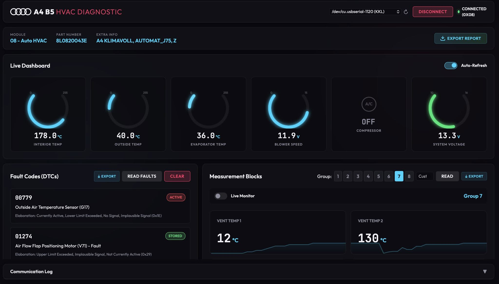

# Audi A4 B5 (8D2) HVAC Diagnostic Tool




A modern, web-based diagnostic and reverse-engineering tool for the **Audi A4 B5 (1994-2001) Auto HVAC** (Climate Control) module over the vintage **KWP1281** protocol. Connect to your vehicle using a standard KKL (FTDI) diagnostic cable to read faults, stream live measurement blocks, and visualize sensor data on an interactive dashboard.

---

## Key Features

### Modern Web Dashboard
- **Glassmorphism UI:** A sleek, dark-themed automotive dashboard accessible directly via a web browser.
- **Port Auto-Detection:** Automatically scans and connects to your KKL/FTDI serial port.

### Live Data & Gauges
- **Real-Time Arc Gauges:** Monitor vital systems like Compressor Status, System Voltage, and Cabin/Outside/Evaporator Temperatures.
- **Live Data Monitor:** Stream sensor data using Server-Sent Events (SSE) with real-time sparkline charts.
- **Measurement Blocks:** View raw and decoded sensor data across all 8 HVAC measurement groups utilizing 70+ VAG mathematical formulas.

### Interactive Sensor Map
- **2D Car SVG Diagram:** See the exact physical location of every HVAC sensor (G17, G56, G65, G86, G89, G107, G263) and flap motor (V68, V70, V71, V85).
- **Health Indicators:** Sensor dots dynamically change color (Cyan = Normal, Orange = Warning, Red Pulsing = Fault/Open Circuit, e.g., -49°C readings).

### Diagnostics & Export
- **Read & Clear Faults (DTCs):** Built-in database of HVAC-specific fault codes with detailed status elaborations (Active, Stored, Intermittent).
- **Export to JSON:** Export full diagnostic reports (DTCs + Measurement Blocks) tailored for analysis by AI tools.

---

## Requirements

### Hardware
- A genuine **FTDI FT232RL based KKL VAG-COM cable**. 
  > **Warning:** Cheap clone chips often struggle with the precise 5-baud timing required to wake up the ECU.
- An Audi A4 B5 (8D2) or similar era VAG vehicle with a compatible Climate Control module (Address `0x08`).

### Software
- Python 3.9+
- Pip package manager

## Installation & Setup

1. Clone this repository:
   ```bash
   git clone git@git.muradjabir.com:muradjabir/audi_8d2_diag.git
   cd audi_8d2_diag
   ```

2. Install the required Python dependencies:
   ```bash
   pip install -r requirements.txt
   ```
   *(This project uses `pyserial` for hardware communication and `Flask` for the web server).*

## Usage

1. **Plug in:** Connect your KKL cable to your vehicle's OBD-II port.
2. **Power up:** Turn the ignition to the ON position (the engine does not need to be running, but the climate control must have power).
3. **Connect to PC:** Plug the KKL cable into your computer's USB port.
4. **Start the Server:**
   ```bash
   python3 app.py
   ```
5. **Launch Dashboard:** Open your web browser and navigate to `http://127.0.0.1:5000`.
6. Select your port from the dropdown and click **Connect**.

---

## Technical Details

- **Protocol:** KWP1281 (Key-Word Protocol 1281) via K-Line (ISO 9141).
- **Initialization:** 5-baud "slow init" bit-banging via standard UART Break signals.
- **Module Address:** `0x08` (Auto HVAC).
- **Communication:** Byte-level complement acknowledgement system.
- **Keep-Alive:** Automatic background polling to prevent ECU timeouts.

---

## Safety Warning

> **CAUTION:** This tool communicates directly with vehicle electronics on the K-Line. While it is designed to be read-only (with explicit confirmation required for clearing faults), using incorrect or cheap counterfeit cables can potentially introduce noise on the K-Line or cause communication errors. Do not use this tool while the vehicle is in motion. Use at your own risk.
